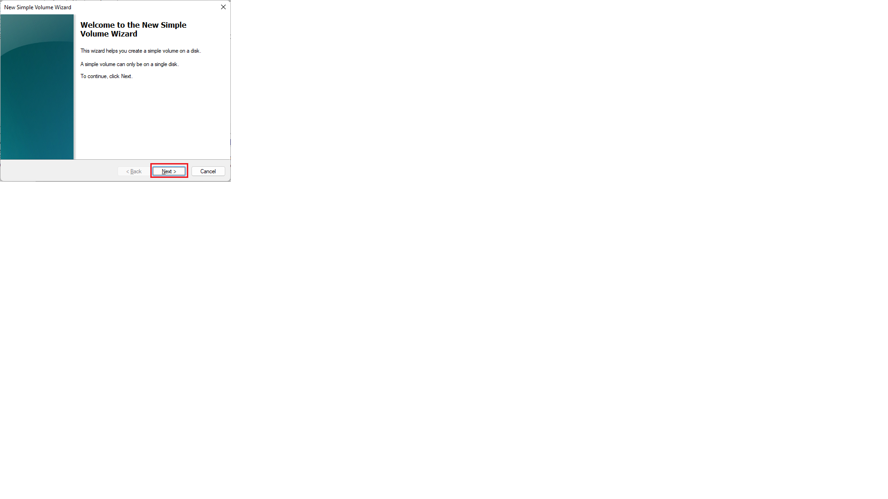
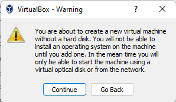

# QUBIC
## Various information that helped me in setting up and installing qubic

<br>
<br>

## Table Of Contents
---
> 1. [Installation on a VM (Virtual Box) on a WinServer or Win10 host](#install_on_vm)
>    1. [Installing Virtual Box](#Installing_Virtual-Box)
>    2. [Preparing the boot disk](#Preparing_the_boot_disk)
>    3. [VM settings](#VM_settings)
>    4. [How to place Qubic files on disk](#How_to_place_Qubic_files_on_disk)

<br>
<br>

<a name="install_on_vm"></a>
# Installation on a VM (Virtual Box) on a WinServer or Win10 host
To work on a virtual machine, we will need a virtualization software product (in our case, VirtualBox) and a boot disk, which we will make using Windows OS.
Setting up a virtual disk is very close to setting up a USB drive described on [Qubic-World
](https://github.com/Qubic-World/qubic-howto#preparing-usb).

<br>

---

<br>

<a name="Installing_Virtual-Box"></a>
## Installing Virtual Box ([graphical representation of text material](#graph_installing_virtual_box))
You can download VirtualBox from any website, but I advise you to use the [official website](https://www.virtualbox.org/).

>1. Download VirtualBox by clicking on the big blue `Download` button
>2. After selecting the desired operating system
>3. Start the installation by double-clicking on the installer shortcut.
`next -> next -> next -> yes -> Install`

<br>

---

<br>

<a name="Preparing_the_boot_disk"></a>
## Preparing the boot disk ([graphical representation of text material](#graph_preparing_boot_disk))
We create a virtual disk using standard Windows tools.

>1. Opening Computer Management -> Disk Management
>2. Action -> Create VHD
>3. In the `location` field, specify the full path to the file and its name
>4. In the Virtual hard disk size line, specify the required volume of the disk being created
>5. Specify `VHD` as the disk format
>6. Specify `Fixed size` as the disk type (There were problems with the file system markup with dynamic volume, I'm deciding how to get around it)
>7. Click OK

After the completed actions, a new space will appear in Computer Management. For further configuration, we do the following steps.
>1. Right-click on Disk* (Unknown)
>2. Initialize disk
>3. Choose the markup style `MBR` -> OK
>4. Right-click on the free space of the new disk (Unallocated)
>5. New Simple Volume -> next -> next -> next ->
>6. File system - `FAT32`
>7. Next -> Finish

The new memory space will appear in explorer as a separate disk. After writing the required files, you need to disconnect the created virtual disk from the system.
>1.  Opening Computer Management -> Disk Management
>2. Right-click on the created disk -> Detach VHD -> OK

Only after these steps can you attach the disk to the VM.
To make changes to the files located on this virtual disk, it needs to be connected back to the system (if the disk is connected to a virtual machine, you need to stop it before starting actions with the disk, in order to avoid problems with a busy device).
>1. Opening Computer Management -> Disk Management
>2. Action -> Attach VHD
>3. Select the disk by its location -> OK
The disk will appear in explorer.

<br>

---

<br>

<a name="VM_settings"></a>
## VM settings ([graphical representation of text material](#graph_vm_settings))
We will touch not only the configuration of the virtual machine, but also the creation.

>1. Machine -> New
>2. Specify the name of the virtual machine and the desired location
>3. Type -> `Other`
>4. Version -> `Other/Unknown (64-bit)` -> next
>5. Allocate the possible amount of RAM -> next
>6. Hard Disk -> Do not add virtual hard drive -> Create -> Continue

Go to the settings of the virtual machine itself.
>1. Right-click on the created machine -> Settings
>2. System -> `Enable EFI (special Forces only)`
>3. System -> Processor -> Specify the number of processor cores
>4. Network -> Attached to: `NAT` -> Advanced -> Adapter type: `Paravirtualized Network (virtio-net)`
>5. Network -> Advanced -> `Port Forwarding` -> Right-click -> Add New Rule -> `Host port: 21841` -> `Guest Port: 21841` -> OK
>6. Storage -> `Controller: IDE` -> Right-click -> Hard Disk -> Select a previously created disk -> OK

<br>

---

<br>

<a name="How_to_place_Qubic_files_on_disk"></a>
## How to place Qubic files on disk 

Below I describe exactly the files that I use. You can do it differently.
All these files (except Qubic.efi) can be downloaded [here](https://mega.nz/folder/Yx5jCA4B#ouRFwLg_32Z1vdqvK1y16Q). If you are afraid to open it .zip from a stranger - I will place a folder with the same files next to the archive :)
The Qubic.efi file itself is the result of compiling the code (insert your own).

```
└── mining.data
└── solution.data
└── system.data
└── efi
     └── boot
           └── bootaa64.efi
           └── bootarm.efi
           └── bootia32.efi
           └── bootriscv64.efi
           └── bootx64.efi
           └── HttpDxe.efi
           └── Qubic.efi
           └── startup.nsh 
```

<br>

---

<br>


<a name="graph_installing_virtual_box"></a>
## Installing Virtual Box (graphical representation)
Each screenshot shows a sequence of actions.


<br>

---

<br>

<a name="graph_preparing_boot_disk"></a>
## Preparing the boot disk (graphical representation)
Each screenshot shows a sequence of actions.





<br>

---

<br>

<a name="graph_vm_settings"></a>
## VM settings (graphical representation)
Each screenshot shows a sequence of actions.





